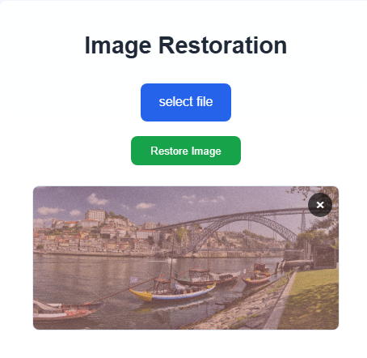
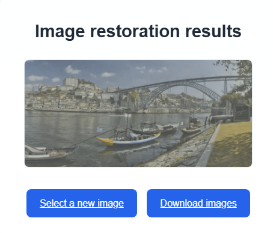

# Image Restoration Tool (GPU Required)

End-to-end image restoration pipeline: **DEM → ARF → FEM**  
- **DEM**: Detects degradation types (blur / noise / low-res)  
- **ARF**: Selects the appropriate model (DeblurGANv2 / FFDNet / EDSR, etc.)  
- **FEM**: Final enhancement (e.g., color / white balance)  
Web UI built with **Flask** and **requires an NVIDIA GPU**.

---

## Demo

| | | |
|:---:|:---:|:---:|
|  |  |  |

---

## Features
- Automatic model selection based on DEM results  
- Supports DeblurGANv2 / FFDNet / EDSR (easy to add/replace models)  
- Web app: upload → process → download

---

## System Requirements
- **OS:** Windows (with NVIDIA GPU)  
- **Python:** 3.10.x (developed on 3.10.4)  
- **NVIDIA Driver:** compatible with CUDA **11.8 / 12.1 / 12.4 / 12.8**  
- **RAM:** ≥ 32 GB for 1080×720 images (varies by model/resolution)

---

## Project Structure
```text
image_restoration/
├─ orchestrator/
│  └─ app.py                 # Flask entry
├─ modules/
│  ├─ dem/                   # Degradation Estimation
│  ├─ arf/                   # Adaptive Restoration Filtering
│  │  └─ deblurganv2/
│  │     ├─ models/
│  │     └─ predict.py
│  └─ fem/                   # Final Enhancement
├─ models/                   # place model weights (.pth)
├─ static/
│  └─ uploads/               # web input/output
├─ requirements.txt          # base deps (torch/torchvision not included)
├─ requirements-cu118.txt    # pick based on your CUDA
├─ requirements-cu121.txt
├─ requirements-cu124.txt
├─ requirements-cu128.txt
└─ README.md
```

---

## Installation

> **GPU first.** Install the CUDA-matched PyTorch build, then the rest of dependencies.  
> You can either use the *one-file* install (recommended) or do it manually.

### Option A — One file (recommended)
Pick the file that matches your CUDA:
```bash
# CUDA 11.8
pip install -r requirements-cu118.txt

# CUDA 12.1
pip install -r requirements-cu121.txt

# CUDA 12.4
pip install -r requirements-cu124.txt

# CUDA 12.8 (works well with newer drivers, e.g., 12.9)
pip install -r requirements-cu128.txt
```

### Option B — Manual
```bash
# 1) Create & activate env (example with conda)
conda create -n img-restore python=3.10.4 -y
conda activate img-restore
python -m pip install -U pip

# 2) Install CUDA-specific PyTorch (example: CUDA 12.8)
pip install --index-url https://download.pytorch.org/whl/cu128 torch==2.8.0 torchvision==0.23.0
pip install torchsummary==1.5.1

# 3) Install remaining packages
pip install -r requirements.txt
```

Verify GPU:
```bash
python -c "import torch; print('CUDA?', torch.cuda.is_available(), 'built for', torch.version.cuda)"
```

---

## Model Weights (download & place files)

**Download link:**  
[Google Drive — models](https://drive.google.com/drive/folders/1eNnmlCfihXMrDVuntymI1xLYxLcXUDXf?usp=drive_link)

After downloading the `models` folder, you will see subfolders: `deblurganv2`, `EDSR`, `ffdnet`, `net-dwb`.  
Move the **files inside each subfolder** to the project paths below (do not nest the outer `models` folder again):

| From (downloaded) | To (in project) |
|---|---|
| `models/deblurganv2/` | `modules/arf/deblurganv2/` |
| `models/EDSR/` | `modules/arf/experiment/model/` |
| `models/ffdnet/` | `modules/arf/ffdnet/models/` |
| `models/net-dwb/` | `modules/fem/models/` |

> Move **only the model files** (e.g., `.pth`, `.pt`) from inside each subfolder.  
> **Wrong:** `modules/arf/deblurganv2/deblurganv2/...`  
> **Correct:** `modules/arf/deblurganv2/*.pth`

---

## Usage

### Run the web app (Flask)
```bash
python orchestrator/app.py
```
Then open: <http://127.0.0.1:5000>
