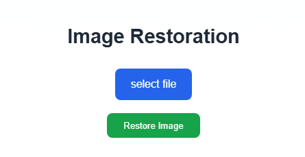

# Image Restoration Tool (GPU Required)

เครื่องมือฟื้นฟูภาพแบบครบลูป: **DEM → ARF → FEM**  
- DEM: ประเมินความเสื่อมภาพ (blur/noise/low-res)  
- ARF: ปรับใช้โมเดลที่เหมาะ (DeblurGANv2 / FFDNet / EDSR ฯลฯ)  
- FEM: เก็บงานท้าย (เช่น สี/white-balance)  
เว็บด้วย Flask และประมวลผลบน ** GPU เท่านั้น**.

## Demo

| | | |
|:---:|:---:|:---:|
|  |  |  |

## คุณสมบัติเด่น
- เลือกโมเดลอัตโนมัติตามผล DEM
- รองรับ DeblurGANv2 / FFDNet / EDSR (เพิ่ม/สลับโมเดลง่าย)
- มีเว็บแอปอัปโหลด → ประมวลผล → ดาวน์โหลด

## ข้อกำหนดระบบ
- OS: Windows (ต้องมี NVIDIA GPU)
- Python: 3.10.x (พัฒนาบน 3.10.4)
- NVIDIA Driver: ที่รองรับ CUDA 11.8 / 12.1 / 12.4 / 12.8
- RAM: ≥ 32GB สำหรับภาพ 1080*720 (ขึ้นกับโมเดล/ขนาดภาพ)

## โครงสร้างโปรเจกต์
image_restoration/
├─ orchestrator/
│  └─ app.py                 # Flask entry
├─ modules/
│  ├─ dem/                   # Degradation Estimation
│  ├─ arf/                   # Adaptive Restoration Filtering
│  │  └─ deblurganv2/
│  │     ├─ models/
│  │     └─ predict.py
│  └─ fem/                   # Final Enhancement
├─ models/                   # วางน้ำหนักโมเดล (.pth)
├─ static/
│  └─ uploads/               # input/output จากเว็บ
├─ requirements.txt          # deps ฐาน (ไม่รวม torch/vision)
├─ requirements-cu118.txt    # เลือกตาม CUDA
├─ requirements-cu121.txt
├─ requirements-cu124.txt
├─ requirements-cu128.txt
└─ README.md

## การติดตั้งโมเดล
-ติดตั้งแพ็กเกจอื่น ๆ
 pip install -r requirements.txt

-ติดตั้ง PyTorch ตาม CUDA (เลือกหนึ่ง)
CUDA 11.8
pip install -r requirements-cu118.txt

CUDA 12.1
pip install -r requirements-cu121.txt

CUDA 12.4
pip install -r requirements-cu124.txt

CUDA 12.8  (ถ้าไดรเวอร์ใหม่ เช่น 12.9 ใช้ชุดนี้ได้)
requirements-cu128.txt

## Model Weights (ดาวน์โหลดและวางไฟล์)

ลิงก์ดาวน์โหลด:https://drive.google.com/drive/folders/1eNnmlCfihXMrDVuntymI1xLYxLcXUDXf?usp=drive_link

หลังดาวน์โหลดโฟลเดอร์ models มาแล้ว ภายในจะมีโฟลเดอร์ย่อย: deblurganv2, EDSR, ffdnet, net-dwb
ให้นำ ไฟล์โมเดลด้านในแต่ละโฟลเดอร์ย่อย ไปวางในโปรเจกต์ตามตารางนี้ (อย่าใส่ซ้อนโฟลเดอร์ซ้ำ):

models/deblurganv2/   -> modules/arf/deblurganv2/
models/EDSR/          -> modules/arf/experiment/model/
models/ffdnet/        -> modules/arf/ffdnet/models/  
models/net-dwb/       -> modules/fem/models/        

หมายเหตุ: ย้ายเฉพาะ ไฟล์โมเดล (เช่น .pth, .pt, ฯลฯ) ที่อยู่ ข้างใน โฟลเดอร์ย่อย ไม่ต้องคงโฟลเดอร์ models ชั้นนอกซ้อนเข้ามาอีกชั้น
ตัวอย่าง “ผิด”: modules/arf/deblurganv2/deblurganv2/...
ตัวอย่าง “ถูก”: modules/arf/deblurganv2/*.pth

##การใช้งาน

รันเว็บแอป (Flask)
python orchestrator/app.py
ปิดเบราว์เซอร์: http://127.0.0.1:5000

